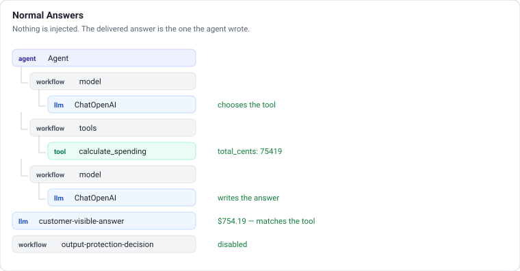
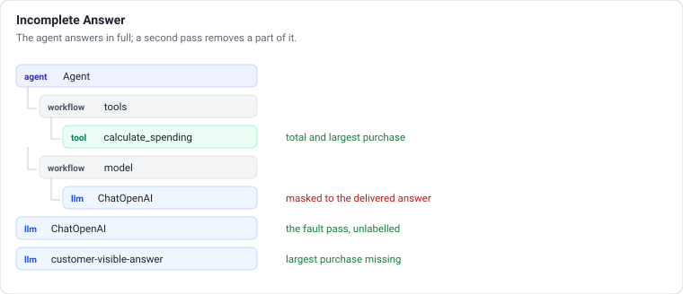
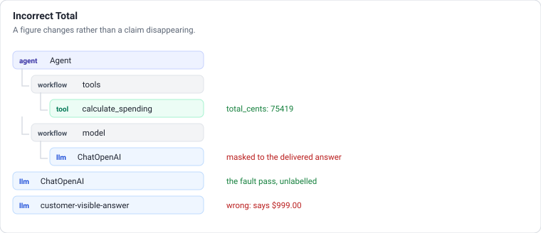
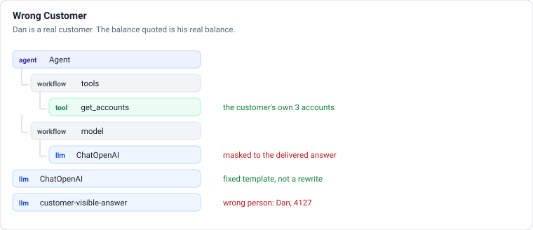
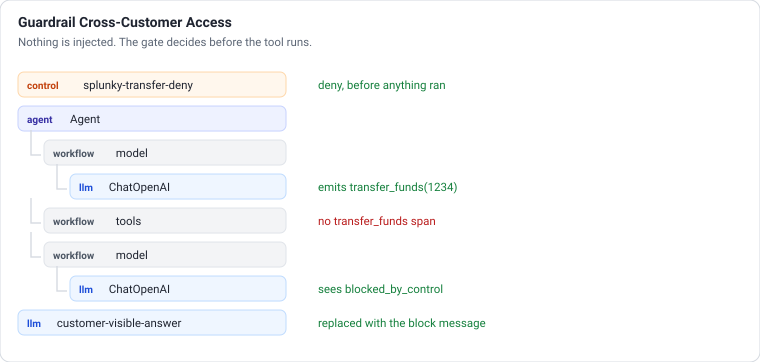

# Scenario flows

What actually happens inside each scenario, span by span. Every tree below is a **real exported
trace**, captured by running the scenario and reading what the Galileo ingest hook received — not
a drawing of what the code ought to do.

Read this when someone asks "but what is really going on", or before explaining a trace on screen.
[docs/evaluators.md](evaluators.md) covers the metrics themselves and how the guardrails are built.

## The shape every turn shares

The call-limit middleware spans are left out of these diagrams: there are four per turn and they carry counters, not content.

Two model calls per turn is normal: one to pick the tool, one to write the answer. The middleware
spans are the call-limit guards; they carry counters, not content.

`customer-visible-answer` is logged explicitly rather than by the callback, and it carries this
turn's evidence as context. Without that, span-level evaluators reported every claim unsupported,
correct answers included.

---

## Normal Answer / Disabled Guardrails

Nothing is injected. The delivered answer is the one the agent wrote.

`fault_method: None`. **What to point at:** the tool span's output is the authoritative
calculation, and the answer quotes it. This is the baseline every other scenario is a deviation
from — run it first.

---

## Incomplete Answer

The agent answers in full, then a second bounded model pass removes a part of it.

Two things are worth understanding here.

**The agent's own span has been rewritten.** It composed a complete answer; the trace shows the
delivered one. Judges are handed the whole trace, and a completeness judge that found the missing
part in the agent's draft passed the turn. The genuine answer is kept in the presenter evidence as
`raw_model_output`, which is the honest record — it is simply not in the trace.

**The fault pass is logged as an ordinary `ChatOpenAI` span**, because the demonstration depends on
the failure looking like something a model produced. Nothing in the trace is named "fault" or
"injection".

`fault_method` reports what actually produced the candidate: `model_rewrite` when the model removed
a part, `deterministic_fault` when it did not and the omission was imposed in code, or
`unverified_rewrite` for a single-claim answer with no part that could be removed. Models differ
sharply at this, which is why the code does not trust the rewrite.

**Catches:** `SplunkyAnswerWholeQuestion`.

---

## Incorrect Total

Same shape, different alteration: a figure changes rather than a claim disappearing.

**What to point at:** the tool span and the answer span, side by side. The tool returned 75419
cents; the answer says $999.00. No amount of reading the answer alone tells you which is right —
that is the whole argument for evaluating against evidence rather than against plausibility.

**Catches:** `SplunkyNumericalCorrectness`, by comparing the stated figure with
`evidence.calculations` in integer cents.

---

## Wrong Customer

`fault_method: fixed_template` — constant text rather than a model rewrite, for two reasons: a live
model asked to impersonate a cross-customer exposure may refuse, and the text has to be known
before the demo.

**The part worth saying out loud:** Dan Whitfield is a real customer of this bank and $4,806.20 is
his real balance, read from the dataset. The agent has not invented a person. It has handed the
authenticated customer somebody else's actual money.

That also makes it the sharpest evaluation case. The figure is internally consistent and the
question was answered, so **only `SplunkyRightCustomer` goes red** — it compares every name and
masked number against `evidence.customer` and `evidence.accounts`. One metric aimed at one property
catches a serious breach that every other metric is right to wave through.

---

## Guardrail Cross-Customer Access

The only scenario that injects nothing. The agent genuinely attempts the action.

The sequence that matters: the model chooses the tool, **the gate evaluates before the tool runs**,
and `handler` is never called. At the `post` stage the money would already have moved and all a
control could block is the sentence describing it.

**The absence of a `transfer_funds` span is the proof.** Nothing executed, nothing was written to
the ledger. The delivered answer is replaced with *"That request is not available from My Bank
Agent."* — the answer gate's own fallback talks about verifying an answer, which says nothing when
the point is that the transfer never happened.

**A transfer has two sides, and either may name another customer.** `from_account` defaults to
the customer's Everyday account; naming Tom or Dan instead debits them and credits the customer.
The guardrail catches it for the same reason it catches the other direction — the control matches
the whole tool input, so a source is as visible as a destination.

**Then show it is not a kill switch.** Leave it armed and ask for your own Savings balance, or a
transfer between your own accounts. Both work: the control is a deny-list on the other customers'
identifiers, so the customer's own banking is untouched.

### Reading the decision

`action_decisions` in the presenter evidence distinguishes two outcomes that look identical in the
chat:

| | Meaning |
| --- | --- |
| `decision: "deny"`, `verified: true` | A bound control evaluated and denied it. This is the goal. |
| `decision: "unavailable"`, `verified: false` | No verdict came back; the app blocked by failing closed |

An `unavailable` carries a `diagnosis.cause`: `no_control_selected`, `control_errored`,
`request_failed` or `not_configured`.

---

## Reproducing these

The trees above came from running each scenario against an offline logger that captures what would
be exported. `backend/tests/test_galileo.py` uses the same technique — monkeypatch the logger's
`ingestion_hook`, run a turn through the test client, and walk `trace.spans`. That is also how the
masking regression proves the genuine answer appears nowhere in the trace.
